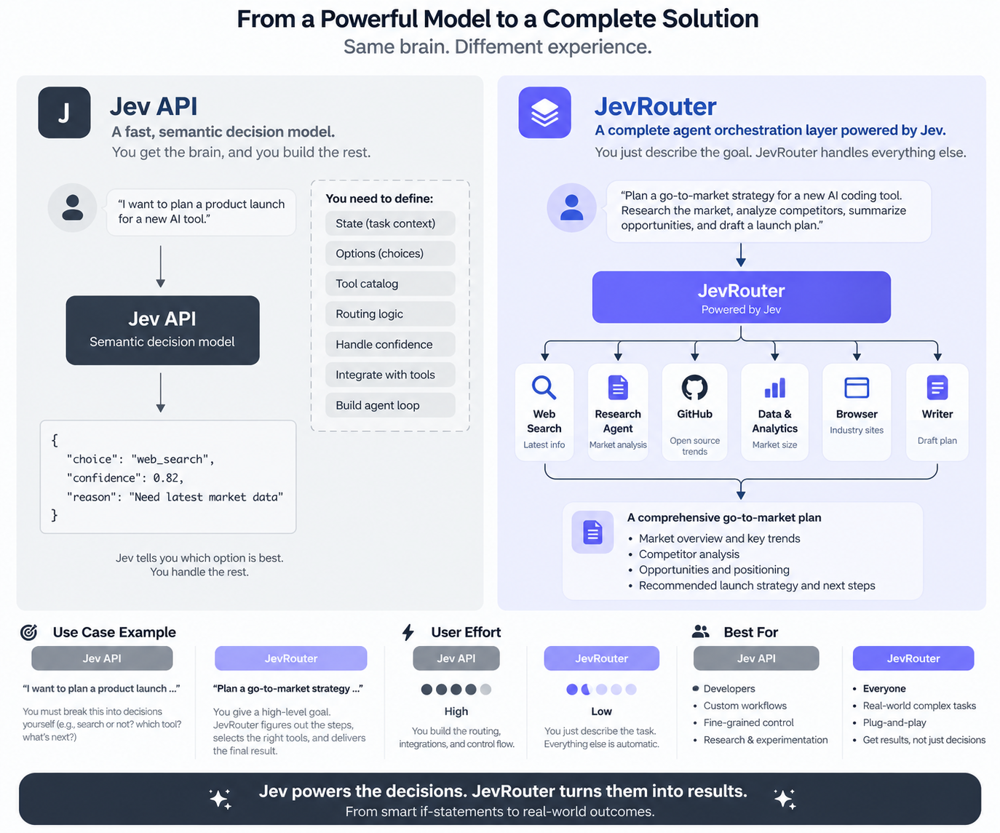

# JevRouter

<p><a href="#jevrouter">English</a> · <a href="#chinese">中文</a></p>

<details open>
<summary>English</summary>

JevRouter is a small, local-first router for Agent capabilities. It turns models, Subagents, Skills, MCP Tools, CLIs and DSH plugins into one candidate set, asks Jev one typed Choice question, and applies hard policy checks around the returned decision.

The key contract is simple: Jev owns the decision probabilities; JevRouter owns availability, permissions, risk and confirmation. Router fields live under `router`, while the original `probabilities`, `confidence`, and complete provider response remain intact. Filtered candidates are never re-normalized.

Small candidate sets use one Jev Choice call. When `single_stage_max_candidates` is exceeded, JevRouter first keeps the coarse Top-K candidates, then asks Jev for a final Choice over that reduced set. Both raw responses are returned in `raw_jev_stages`; coarse probabilities remain attached to candidates that were not sent to the final stage.

## Why this shape

TypeSafe documents Jev as a System One model: structured state in, typed decisions with probability distributions and confidence out. That makes it useful as a fast decision layer in front of tools, while a normal reasoning model can remain the execution or fallback layer. JevRouter keeps that boundary explicit and defaults to decision-only mode.

The core integration is the one-call SDK or CLI. MCP is an optional compatibility adapter for Agents that already load tools through MCP; it exposes one `jev_route` tool and does not execute the selected capability implicitly.



The distinction is architectural: **Jev provides the semantic decision**, while **JevRouter turns that decision into an agent workflow**. With the API alone, the caller still has to define state, options, tool catalogs, confidence handling, integrations, and the agent loop. JevRouter accepts a high-level goal, selects and coordinates the relevant capabilities, applies policy, and returns a usable result. The same decision model remains underneath; the developer experience moves from individual choices to complete orchestration.

## Benchmark snapshot

We evaluated Jev on 10 Toolathlon tasks by predicting each task's first five ordered tool calls, comparing it with DeepSeek V4.1 Flash. In serial mode, Jev reached **38% position-wise accuracy** versus 24%, achieved a **0.9 mean longest common prefix** versus 0.5, ran about **5.5× faster** (1.58s vs 8.65s per task), and cost about **7× less** ($0.0058 vs $0.0407 for 10 tasks). The experiment measures ordered routing decisions, not end-to-end task completion.

## Quick start

```bash
npm install
npm run typecheck
npm test

npm run dev -- init
npm run dev -- capability add examples/capabilities/github.issue.search.json
npm run dev -- capability add examples/capabilities/github.issue.create.json
npm run dev -- capability add examples/capabilities/repo.clone.json
npm run dev -- capability add examples/capabilities/summarize.issues.json
npm run dev -- capability add examples/capabilities/dsh.github.workflow.json
npm run dev -- capability add examples/capabilities/model.gpt-6-terra.json
npm run dev -- capability add examples/capabilities/model.claude-sonnet.json
npm run dev -- capability add examples/capabilities/subagent.researcher.json

# Works offline. The result is explicitly labelled jevrouter-demo.
npm run dev -- route --request "查找 owner/repo 最近 30 天的登录失败 issue"
# Inspect a saved decision without calling the provider again.
npm run dev -- decision show <decision-id>
```

To use the official Jev API, set `TYPESAFE_API_KEY` or `JEV_API_KEY` and omit `--provider demo`:

```bash
TYPESAFE_API_KEY=... npm run dev -- route \
  --request "查找 owner/repo 最近 30 天的登录失败 issue"
```

The direct TypeSafe endpoint is `https://api.typesafe.ai/v1/systemone`. For an OpenRouter Jev route, set `OPENROUTER_API_KEY`; JevRouter uses OpenRouter's native Decisions endpoint (`/api/alpha/decisions`) with the `~typesafe/jev-latest` model and labels the provider as `openrouter:~typesafe/jev-latest`.

Start the local HTTP process when an Agent wants a stable boundary:

```bash
npm run dev -- serve --provider demo --port 8787
curl -s http://127.0.0.1:8787/route \
  -H 'content-type: application/json' \
  -d '{"request":"查找登录失败 issue"}'
```

For a one-line TypeScript integration, use the SDK. It reads `JEV_API_KEY`, `TYPESAFE_API_KEY`, or `OPENROUTER_API_KEY` automatically:

```ts
import { route } from "jevrouter";

const decision = await route({ request: "查找登录失败 issue", candidates: tools });
```

The CLI is the equivalent one-line shell interface:

```bash
JEV_API_KEY=... npx jevrouter route --request "查找登录失败 issue"
```

For Codex, Claude, or another MCP-native Agent, run the optional stdio adapter:

```json
{
  "mcpServers": {
    "jevrouter": {
      "command": "npx",
      "args": ["-y", "jevrouter", "serve-mcp"],
      "env": { "JEV_API_KEY": "..." }
    }
  }
}
```

The Agent can call `jev_route` with its current `candidates` array. A candidate can have `type: "model"`, `"subagent"`, `"mcp_tool"`, `"skill"`, `"cli"`, or `"dsh"`; the routing contract is the same.

### One-command Agent setup

For a trusted project, generate the Codex and/or Claude Code MCP entry without writing the key to disk:

```bash
export JEV_API_KEY="your Jev key"
npx --yes github:BillionsBobby/JevRouter agent setup --agent all
```

This creates or updates project-level `.codex/config.toml` and `.mcp.json` additively. Codex receives `JEV_API_KEY` through `env_vars`; Claude Code uses `${JEV_API_KEY}` expansion. Restart the Agent after setup. The MCP server instructions tell the Agent to call `jev_route` before choosing a meaningful model, Tool, or Subagent; the Agent still performs the selected execution.

For only one host:

```bash
npx --yes github:BillionsBobby/JevRouter agent setup --agent codex
npx --yes github:BillionsBobby/JevRouter agent setup --agent claude
```

The generated MCP command uses the public GitHub package source so this works before an npm release. After `jevrouter` is published, set `JEVROUTER_PACKAGE=jevrouter` before setup to use the npm package instead.

## Manifest contract

```json
{
  "id": "github.issue.search",
  "name": "Search GitHub issues",
  "type": "mcp_tool",
  "description": "Search issues in a GitHub repository.",
  "input_schema": { "type": "object", "properties": { "query": { "type": "string" } } },
  "permissions": ["github.read"],
  "risk": { "level": "low", "categories": ["external_read"] },
  "availability": { "available": true },
  "execution": { "mode": "mcp", "target": "github", "dry_run": true },
  "policy": { "requires_confirmation": false }
}
```

Capability discovery accepts local Skill directories, MCP server configuration, CLI names, and DSH plugin manifests:

```bash
npm run dev -- discover \
  --skills examples/skills \
  --mcp examples/mcp.json \
  --cli git,docker \
  --dsh examples/dsh
```

Skill discovery reads `SKILL.md` frontmatter, CLI discovery only calls `<command> --help`, MCP discovery performs `initialize` and `tools/list`, and DSH discovery reads JSON manifests. Discovered capabilities are converted into manifests and written only when their destination does not already exist. Secrets stay in the child process environment and are not copied into manifests.

## Decision response

`route` returns:

- `decision.jev_choice`: the option Jev selected.
- `decision.candidates[].jev_probability`: the exact probability for that option from the provider response.
- `decision.candidates[].router`: availability, permission, risk, confirmation and filter explanation.
- `RouteInput.actor_permissions`: optional caller permissions; when supplied, a capability is filtered if any manifest permission is missing.
- `RouteInput.input`: optional tool arguments; when supplied, the selected manifest's JSON Schema subset is validated before returning a selection.
- `raw_jev`: the complete provider response, including the OpenRouter envelope when the compatibility adapter is used.
- `raw_jev_stages`: coarse and final provider responses when two-stage routing is active.
- `decision.candidates[].jev_stage`: `single`, `coarse`, or `final`.
- `provenance.candidate_snapshot_hash`: stable hash of the sorted candidate set.

When Jev selects a filtered candidate, the router can choose the highest-probability safe candidate, but records that fact in `fallback.reason` and keeps `jev_choice` unchanged. When confidence is below policy, the result is `no_decision` and `selected` is `null`.

## Multi-step plans

`route` answers one question. `plan` answers "which capability should handle step 1..N of this request?" in two modes:

- **Serial** (default): one full routing decision per step. The capabilities selected in earlier steps are appended to the state (`Capabilities already routed in previous steps, in order: ...`), so later steps are conditioned on the plan so far. Works with any candidate count; two-stage routing still applies per step.
- **Batch**: all step questions (`step1`..`stepN`) are asked in a single provider call over the same candidate set — the cheapest and fastest shape. Requires the candidate count to fit `single_stage_max_candidates` (no per-step two-stage); use serial mode for larger sets.

```bash
npm run dev -- plan --request "查找 owner/repo 的登录失败 issue 并汇总成报告保存到本地" --steps 3 --mode serial
npm run dev -- plan --request "search issues then summarize them" --steps 3 --mode batch
```

```ts
import { plan } from "jevrouter";

const result = await plan({ request: "search issues then summarize them", candidates: tools }, { steps: 3, mode: "batch" });
```

The plan contract reuses the routing contract per step:

- `steps[]` is a list of full routing decisions with an added 1-based `step` index: per-step `selected`, `jev_choice`, `status`, candidate probabilities and `router` annotations, and per-step `fallback`. The confidence threshold and filters apply to every step independently.
- Batch mode stores the single provider envelope in `plan.raw_jev` (per-step `raw_jev` is `null`); serial mode keeps each step's own `raw_jev` (plan-level `raw_jev` is `null`).
- Serial mode feeds only post-policy `selected` capabilities forward; a `no_decision` step adds nothing to the state.
- Plans are saved append-only to `.jevrouter/plans/`, alongside decisions.

## Security posture

- Decision-only is the only mode in this MVP; no CLI, Skill, MCP or DSH action runs implicitly.
- Medium/high/critical capabilities require confirmation by default.
- Missing permissions, unavailable capabilities and disallowed risk levels are hard filters.
- API keys are read from environment variables and never written to manifests or decision files.
- Decision files are append-only; rerunning a route creates a new decision ID.
- CLI requests reuse a local cache keyed by provider, state, and the exact candidate snapshot; set `JEV_ROUTER_CACHE=0` to disable it.

## Scope and evidence

The Jev API shape in this repository follows TypeSafe's public docs: `POST /v1/systemone` with `state`, `model`, and a `Choice` question; responses contain `choice`, `probabilities`, and `confidence`. The OpenRouter adapter follows OpenRouter's public Decisions endpoint and preserves the returned typed answers. Provider performance and accuracy claims remain provider claims; this repository does not present them as JevRouter benchmarks.

## License

MIT.

</details>

<details id="chinese">
<summary>中文</summary>

JevRouter 是一个本地优先的 Agent 能力路由器。它将模型、Subagent、Skill、MCP 工具、CLI 和 DSH 插件统一为候选集，由 Jev 提出一个类型安全的 Choice 问题，再由 JevRouter 执行可用性、权限、风险和确认策略。

核心契约很简单：Jev 负责决策概率；JevRouter 负责安全边界。路由字段位于 `router` 下，原始 `probabilities`、`confidence` 和完整 provider 响应都会保留。被过滤的候选不会被重新归一化。

候选集较小时只调用一次 Jev Choice。当候选数超过 `single_stage_max_candidates`，JevRouter 先保留粗排 Top-K，再对缩小后的集合进行最终 Choice。两阶段原始响应保存在 `raw_jev_stages` 中。

## 为什么采用这种架构

TypeSafe 将 Jev 定义为 System One 模型：输入结构化状态，输出带概率分布和置信度的类型化决策。因此 Jev 适合作为工具前的快速决策层，而普通推理模型可以继续负责执行或兜底。JevRouter 明确保留这条边界，默认只做决策，不隐式执行能力。

核心集成是一次调用的 SDK 或 CLI。MCP 是可选兼容适配器，向已经通过 MCP 加载工具的 Agent 暴露一个 `jev_route` 工具，但不会隐式执行选中的能力。


这张图说明了两层的分工：**Jev 提供语义决策能力**，**JevRouter 将决策组织成 Agent 工作流**。只使用 API 时，调用方仍需自行定义状态、选项、工具目录、置信度处理、工具集成和 Agent 循环；使用 JevRouter 时，只需描述目标，路由器负责选择和编排相关能力、执行策略检查，并返回可使用的结果。底层仍是同一个决策模型，但开发体验从单次选择提升为完整编排。

## 基准结果概览

我们在 Toolathlon 的 10 个任务上，让 Jev 与 DeepSeek V4.1 Flash 预测每个任务前 5 个有序工具调用。Jev 串行模式达到 **38% 的位置命中率**（DeepSeek 为 24%）、**0.9 的平均最长公共前缀**（0.5），速度约快 **5.5 倍**（每个任务 1.58 秒对 8.65 秒），10 个任务成本约低 **7 倍**（$0.0058 对 $0.0407）。该实验衡量的是有序路由决策，不是端到端任务完成率。

## 快速开始

```bash
npm install
npm run typecheck
npm test

npm run dev -- init
npm run dev -- capability add examples/capabilities/github.issue.search.json
npm run dev -- route --request "查找 owner/repo 最近 30 天的登录失败 issue"
npm run dev -- decision show <decision-id>
```

离线运行时，结果会明确标记为 `jevrouter-demo`。使用官方 Jev API 时，设置 `TYPESAFE_API_KEY` 或 `JEV_API_KEY` 并省略 `--provider demo`：

```bash
TYPESAFE_API_KEY=... npm run dev -- route \
  --request "查找 owner/repo 最近 30 天的登录失败 issue"
```

直接 TypeSafe endpoint 是 `https://api.typesafe.ai/v1/systemone`。使用 OpenRouter 时设置 `OPENROUTER_API_KEY`；JevRouter 会调用 OpenRouter Decisions endpoint `/api/alpha/decisions`，模型为 `~typesafe/jev-latest`。

启动本地 HTTP 服务：

```bash
npm run dev -- serve --provider demo --port 8787
curl -s http://127.0.0.1:8787/route \
  -H 'content-type: application/json' \
  -d '{"request":"查找登录失败 issue"}'
```

SDK 用法：

```ts
import { route } from "jevrouter";

const decision = await route({ request: "查找登录失败 issue", candidates: tools });
```

CLI 等价用法：

```bash
JEV_API_KEY=... npx jevrouter route --request "查找登录失败 issue"
```

对于 Codex、Claude 或其他 MCP-native Agent，可运行可选的 stdio 适配器：

```json
{
  "mcpServers": {
    "jevrouter": {
      "command": "npx",
      "args": ["-y", "jevrouter", "serve-mcp"],
      "env": { "JEV_API_KEY": "..." }
    }
  }
}
```

Agent 可以使用当前的 `candidates` 数组调用 `jev_route`。候选类型可以是 `model`、`subagent`、`mcp_tool`、`skill`、`cli` 或 `dsh`，路由契约保持一致。

### 一条命令配置 Agent

对于可信项目，可以生成 Codex 和/或 Claude Code 的 MCP 配置，且不会把密钥写入磁盘：

```bash
export JEV_API_KEY="your Jev key"
npx --yes github:BillionsBobby/JevRouter agent setup --agent all
```

该命令会以增量方式创建或更新项目级 `.codex/config.toml` 和 `.mcp.json`。Codex 通过 `env_vars` 获取 `JEV_API_KEY`，Claude Code 使用 `${JEV_API_KEY}` 展开。配置完成后重启 Agent。

## Manifest 契约

```json
{
  "id": "github.issue.search",
  "name": "Search GitHub issues",
  "type": "mcp_tool",
  "description": "Search issues in a GitHub repository.",
  "input_schema": { "type": "object", "properties": { "query": { "type": "string" } } },
  "permissions": ["github.read"],
  "risk": { "level": "low", "categories": ["external_read"] },
  "availability": { "available": true },
  "execution": { "mode": "mcp", "target": "github", "dry_run": true },
  "policy": { "requires_confirmation": false }
}
```

能力发现支持本地 Skill 目录、MCP 服务配置、CLI 名称和 DSH 插件 manifest：

```bash
npm run dev -- discover \
  --skills examples/skills \
  --mcp examples/mcp.json \
  --cli git,docker \
  --dsh examples/dsh
```

Skill 发现读取 `SKILL.md` frontmatter；CLI 发现只调用 `<command> --help`；MCP 发现执行 `initialize` 和 `tools/list`；DSH 发现读取 JSON manifest。密钥只留在子进程环境中，不会复制到 manifest。

## 决策响应

`route` 返回：

- `decision.jev_choice`：Jev 选择的选项。
- `decision.candidates[].jev_probability`：provider 返回的原始概率。
- `decision.candidates[].router`：可用性、权限、风险、确认和过滤原因。
- `raw_jev`：完整 provider 响应，包括 OpenRouter 兼容层 envelope。
- `raw_jev_stages`：两阶段路由时的粗排和最终响应。
- `provenance.candidate_snapshot_hash`：排序后候选集的稳定哈希。

如果 Jev 选择了被过滤的候选，路由器可以选择概率最高的安全候选，同时在 `fallback.reason` 中记录原因并保留原始 `jev_choice`。当置信度低于策略阈值时，返回 `no_decision`，且 `selected` 为 `null`。

## 多步计划

`route` 回答一个问题；`plan` 回答“请求的第 1 到第 N 步分别由哪个能力处理”。

- **串行模式（默认）**：每一步做一次完整路由决策，并把前面已选择的能力按顺序加入状态，后续步骤因此会结合已有计划。
- **批量模式**：在一次 provider 调用中询问 `step1` 到 `stepN`，速度和成本更低；候选数量必须不超过 `single_stage_max_candidates`。

```bash
npm run dev -- plan --request "查找 owner/repo 的登录失败 issue 并汇总成报告保存到本地" --steps 3 --mode serial
npm run dev -- plan --request "search issues then summarize them" --steps 3 --mode batch
```

计划会复用逐步路由契约：每个 `steps[]` 元素都包含选择、概率、状态、策略标注和 fallback。串行模式只把策略过滤后的 `selected` 能力传入下一步；计划以追加方式保存在 `.jevrouter/plans/`。

## 安全边界

- MVP 只有决策模式，不会隐式运行 CLI、Skill、MCP 或 DSH 动作。
- 中、高、严重风险能力默认需要确认。
- 缺少权限、不可用能力和被禁止的风险级别都会被硬过滤。
- API key 只从环境变量读取，不写入 manifest 或决策文件。
- 决策文件只追加写入，重复路由会生成新的决策 ID。
- CLI 请求使用 provider、状态和完整候选快照组成的本地缓存；设置 `JEV_ROUTER_CACHE=0` 可禁用缓存。

## 范围与证据

本仓库的 Jev API 形状遵循 TypeSafe 公开文档：`POST /v1/systemone` 接收 `state`、`model` 和 `Choice` 问题，响应包含 `choice`、`probabilities` 和 `confidence`。OpenRouter 适配器遵循公开 Decisions endpoint 并保留 typed answers。provider 的性能和准确率属于 provider 或实验报告中的结果，本仓库不把它们宣称为 JevRouter 自有基准。

## 许可证

MIT。

</details>
